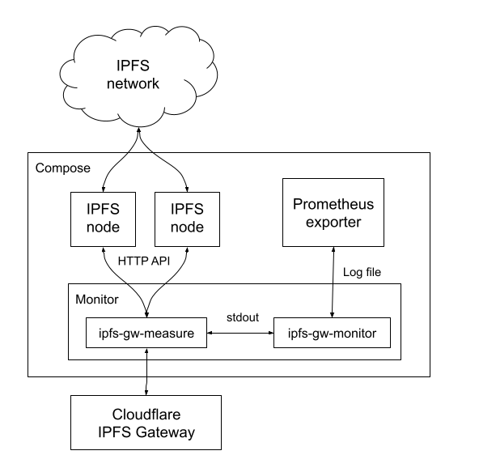

# IPFS Gateway Monitor

Detect the errors and measure the response time of IPFS gateways.

## Development

Run the following command and the executables will be available in `/bin`.
```
make build
```

Run the following command and the executables will be installed in `$GOPATH/bin`.
```
make install
```

Run the following command to prettify the source code.
```
make pretty
```

Run the following command to build the Docker image of the monitor.
```
make compose-build
```

Run the following command to run the monitor with IPFS nodes in Docker Compose.
```
make compose-up
```

Run the following command to remove the containers of the monitor and IPFS nodes in Docker Compose.
```
make compose-down
```

### Pinata JWT

In order to upload the IPFS content through Pinata, you need to have the [Pinata JWT](https://docs.pinata.cloud/) from your Pinata account.

If you are running ipfs-gw-monitor or ipfs-gw-measure directly, you can put the JWT in the -pinata-jwt argument directy.

If you are running the Docker Compose using `make compose-up`, you need to create and put the JWT in a secret file "pinata-jwt.txt" and then you can run `make compose-up`.

## Components



### Monitor

The monitor is the container which has two binaries inside: ipfs-gw-measure and ipfs-gw-monitor

#### ipfs-gw-measure

This binary is where the logic of all the scenarios is implemented. Once it's run, it will run all the scenarios and it will detect the error and measure the response time of each scenario. The important functions of ipfs-gw-measure include

* ipfs-gw-measure controls the IPFS nodes using [IPFS HTTP API](https://docs.ipfs.io/reference/http/api/).
* Errors and response times resulted from each scenario are produced into stdout.
* Each line in stdout corresponds to the result of one execution of a scenario. It also includes the timestamp the execution is run.

All the available command line options are
```
Usage of ipfs-gw-measure:
  -available-cid value
        The CID of the content that we assume will be always available. The CID here must not be the directory CID. If there are multiple CIDs, please specify this option multiple times.
  -dnslink.empty-domain string
        The domain name that has CNAME'ed to the gateway but has no DNSLink.
  -dnslink.ipfs-domain string
        The domain name that points to the IPFS content.
  -dnslink.ipns-cid string
        The CID which the domain specified in dnslink.ipns-domain option will redirect to.
  -dnslink.ipns-domain string
        The domain name that points to the IPNS name.
  -dnslink.ipns-key string
        The base64-encoded private key used by the IPNS name which is pointed by the domain specified in dnslink.ipns-domain option.
  -gateway-host string
        The hostname of the gateway we will run the scenarios against. (default "cloudflare-ipfs.com")
  -ipfs.unavailable-cid string
        The CID of the content that we assume will be always unavailable.
  -ipns.unavailable-name string
        The IPNS name that we assume will be always unavailable.
  -node value
        The address and port (address:port) of HTTP API of the IPFS node to be used while running the scenarios. If there are multiple nodes available, please specify this option multiple times.
  -pinata-jwt string
        The Pinata JWT to be used to call the Pinata API.
```

#### ipfs-gw-monitor

This binary is an entrypoint of the container. It runs ipfs-gw-measure regularly every **7 minutes** and keep the output of every execution in the log file which in turn will be consumed by the Prometheus exporter.

### IPFS Nodes

In some scenarios, we need more than one IPFS nodes, so we run each node in a dedicated container in the Pod. The node is controlled by the monitor using [IPFS HTTP API](https://docs.ipfs.io/reference/http/api/).

### Prometheus Exporter

This is where the Prometheus metrics will be produced. They are produced by consuming the log file and produce the metrics for the external Prometheus server to fetch regularly.
